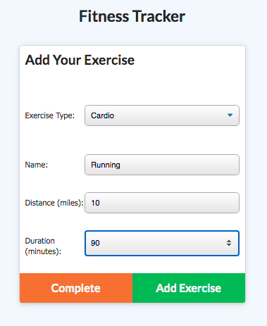
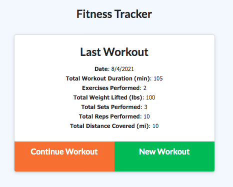
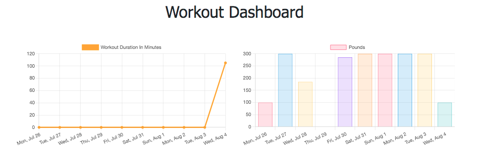

# workout-tracker
uses Mongoose and MongoDB to add workouts and track fitness progress

## Table of Contents

  - [Description](#description)
  - [Installation](#installation)
  - [Usage](#usage)
  - [Contributing](#contributing)
  - [License](#license)
  - [Tests](#tests)
  - [Contact](#contact)
  - [Screenshots](#screenshots)

  ## Description

  This app is designed for a user who wants to add workouts (cardio or resistance), continue their workout, and track their fitness stats over a weekly time period. It primarily uses express, mongoose, and MongoDB to facilitate the capturing of user input into and out of Robo 3T/MongoDB Atlas. 
  
  Technologies used: Javascript, Node, MongoDB, mongoose, MongoDB Atlas, express, and nodemon. See package.json file for complete list.

  To see Workout Tracker in action, check out the deployed app on Heroku here:

  

  ## Installation

  To install npm dependencies (mongoose, etc), please use this command >> `npm i`

  ## Usage

  Once the user hits the landing page, she/he sees the option to add a new workout or if familiar w/app continue an existing workout. There are two types of workouts: cardio and resistance. As the user enters in data their input is captured and accumulated for each workout. This is displayed on the homepage as the last workout along with its relevant totals. Once the user is done they can see their progress for each day on a weekly basis via the workout dashboard/stats page.

  To run locally after installing and while developing, run this command `node server.js` or `npm start watch`.
  To seed the database, first create a db in Robo 3T called workout (all lowercase), then run this command `npm run seed`.  

  ## Contributing
  
  Please add descriptive commit messages and comments. Remember to do a `npm install` for relevant dependencies and other packages that you desire. Create a `.gitignore` for the `node_modules` and `package-lock.json` folder if/when pushing to GitHub.

  ## License
  
 

  ## Tests

  * No tests were developed. 
  
  ## Contact

  * If you have any questions/concerns regarding the app, please contact me on GitHub here (see portfolio app for contact info): https://github.com/tedheikkila

## Screenshots

  * homepage

  

  * resistance workout

  

  * cardio workout

  

  * accumulated workout totals

  

  * workout dashboard/stats page

  
