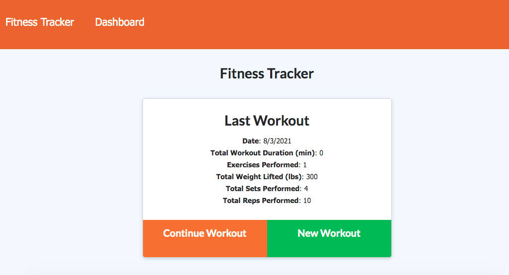
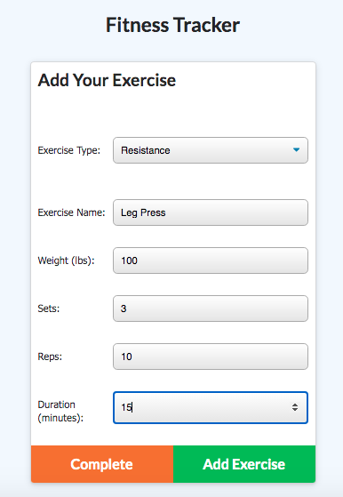

# workout-tracker
uses Mongoose and MongoDB to add workouts and track progress

# tech-blog
creates user profile. captures blog and comment events

## Table of Contents

  - [Description](#description)
  - [Installation](#installation)
  - [Usage](#usage)
  - [Contributing](#contributing)
  - [License](#license)
  - [Tests](#tests)
  - [Contact](#contact)
  - [Screenshot](#screenshots)

  ## Description

  What is this app and what does it do:

  This app is designed for a user who wants to placeholder.
  
  Technologies used: Javascript, Node, MongoDB, mongoose, morgan, express, and nodemon (dev dep). See package.json file for complete list.

  * To see the app in action, check out the deployed app on Heroku here >> 

  ## Installation

  To install npm dependencies (mongoose, etc), please use this command >> npm install

  ## Usage

  Here's the essentials for what you need to know to use this app: 

  Once the user hits the landing page, she/he sees placeholder.

  ## Contributing

  To contribute to this app, please follow these instructions: 
  
  Please add descriptive commit messages and comments. Remember to do a npm install for relevant dependencies and other packages that you desire. Create a .gitignore for the node_modules, .env, and package-lock.json folder if/when pushing to GitHub.

  ## License
  
 

  ## Tests

  * No tests were developed. 
  
  ## Contact

  * If you have any questions/concerns regarding the app, please contact me on GitHub here (see portfolio app for contact info): https://github.com/tedheikkila

## Screenshots

  * homepage

  

   * placeholder

  

 

